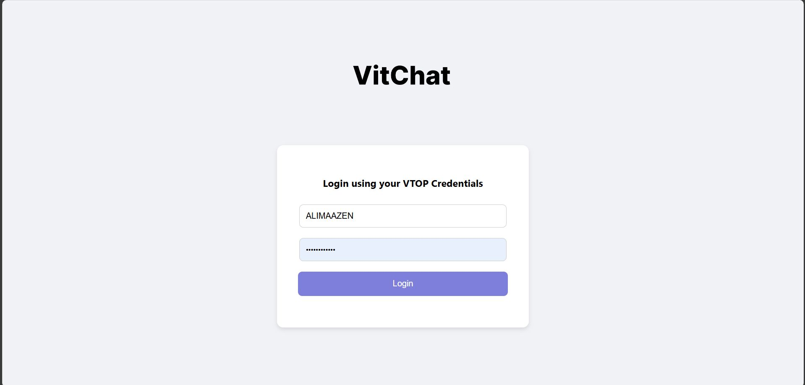
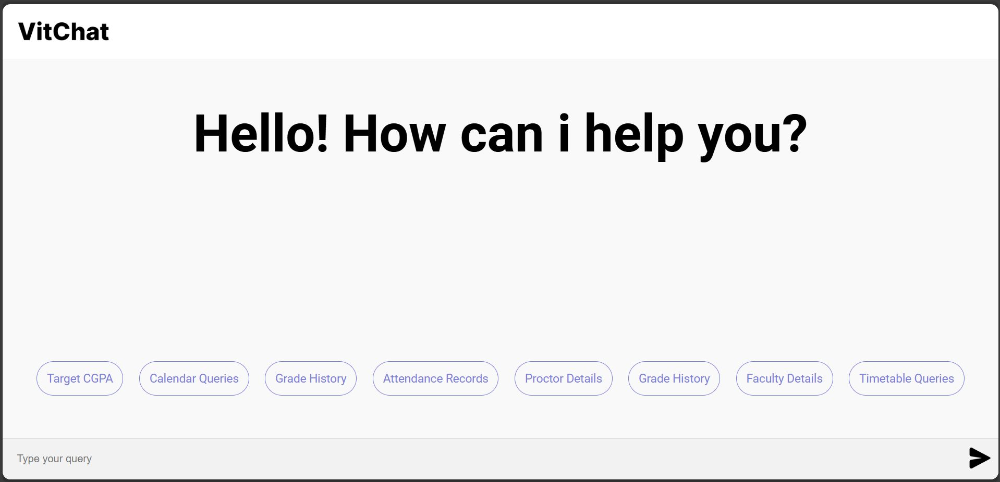
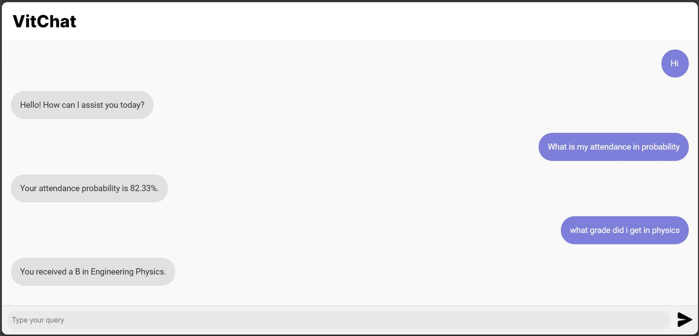
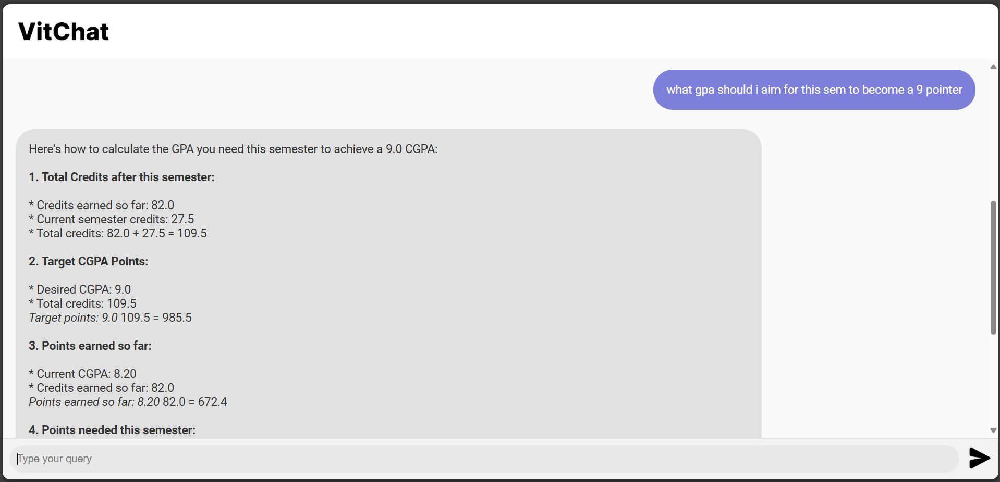
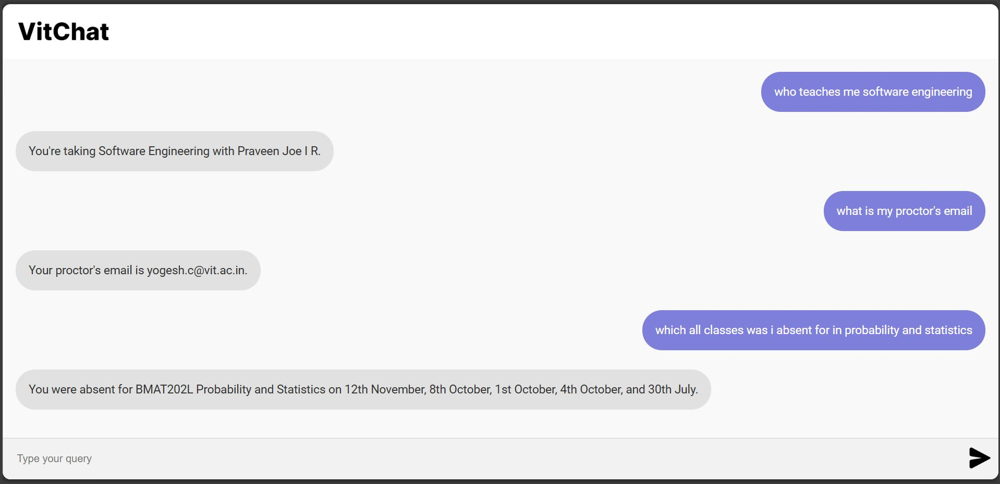

# VitChat 💬

VitChat is a personalized chatbot designed specifically for VITC students. It provides quick, accurate answers to academic queries by leveraging your VITC credentials.

---

## Features

- 🗓️ **Timetable & Academic Calendar:** Quickly get information about your semester timetable and important academic dates.  
- 📝 **Attendance & Academic Performance:** Instantly access your attendance records, grades, and academic history.  
- 👩‍🏫 **Faculty & Course Details:** Find detailed information about your professors and course structure.  
- 🎯 **CGPA Goal Calculator:** Calculate the GPA you need this semester to reach your target CGPA.  

---

## Coming Soon

- 📄 Leave Application Submission  
- 🗂️ Assignment Queries  

---

## How It Works

VitChat is conversational and intuitive. You can interact naturally, just like chatting with a friend, and get instant, accurate responses.

---

## Screenshots

  

  

---

## Getting Started

1. Log in using your VTOP credentials.  
2. Ask questions related to your academics.  
3. Get instant answers tailored to your student profile.  

---

## Contribution

Contributions are welcome! Feel free to open issues or submit pull requests to improve VitChat.

---

## License

Specify your license here (e.g., MIT License)

---

*Built with ❤️ for VITC students.*
